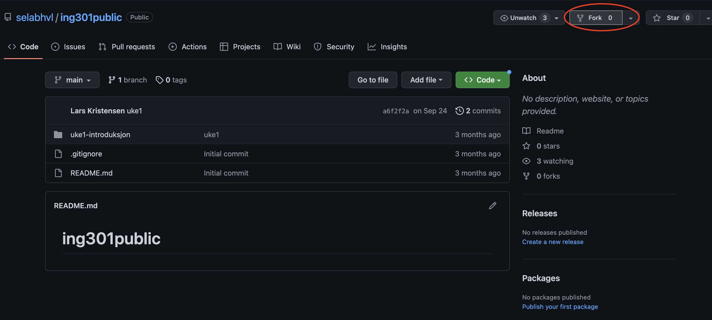
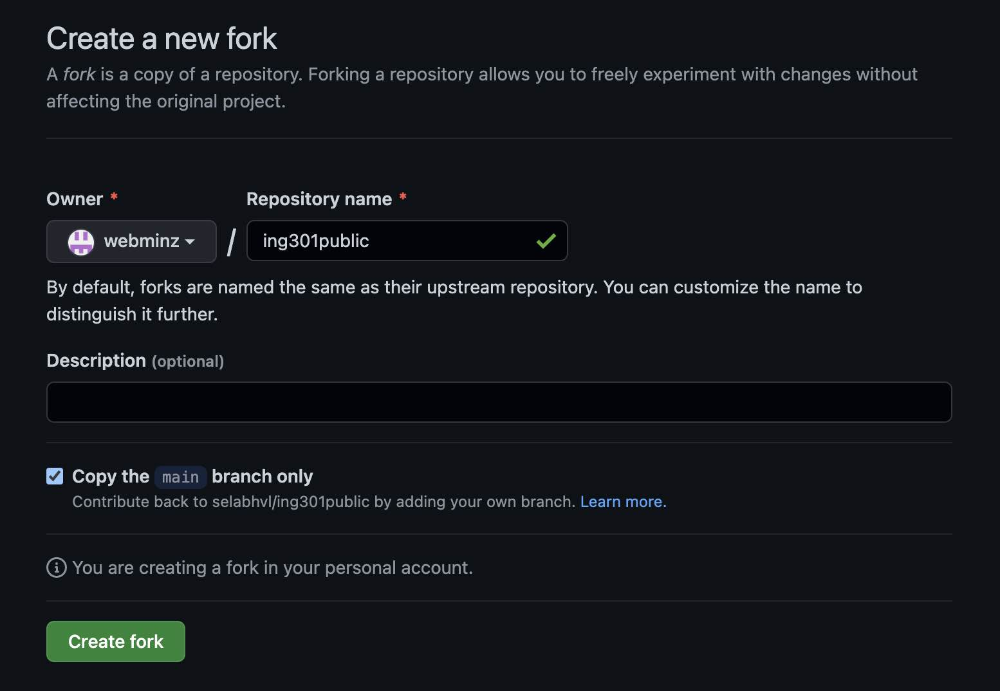

# Oppgaver - Uke 2

Velkommen til første uke med undervisning i ING301.

Målet med denne første _obligatoriske_ oppgave er å sikre at alle har et fungerende utviklingsmiljø for Python programmering og dele koden med andre.

I tilegg skal vi ta en liten repitisjon av noen Python begreper fra ING201.

Innleveringsfrist: se Canvas.

## Steg 1: Kom i gang

Før vi begynner må vi være sikre at alle har installert verktøyene som trengs. Det vil si
- En aktuell versjon av [Python](https://www.python.org/). Den mest aktuelle versjonen akkurat nå er _3.11.1_. Hvis du har allerede installert Python på din maskin, sjekk at den har et versjonsnummer som begynner på _3_!
- Versjoneringssystemet for kode [Git](https://git-scm.com/). 

Se også **video på Canvas** om installasjon av Python programmeringsmiljø.

Lenker til installasjonsinstruks for de forsjellige operativsystemer finder du nedenfor

### Windows

- [Python Installasjon](../../weeks/2-get-started/install_python_windows.md)

- [Git Installasjon](../../weeks/2-get-started/install_git_windows.md)

### Mac OS X

- [Python Installasjon](../../weeks/2-get-started/install_python_mac.md)

- [Git Installasjon](../../weeks/2-get-started/install_git_mac.md)

### Linux

- [Python Installasjon](../../weeks/2-get-started/install_python_linux.md)

- [Git Installasjon](../../weeks/2-get-started/install_git_linux.md)

### IDE og andre grafiske verktøy

Det er fult mulig å skrive kode i Python i en tekseditor som `vim` eller `emacs` og betjene git gjennom kommandolinjen (Windows sitt _Notepad_ anbefales derimot ikke i det hele tatt). 
Men generelt anbefaler vi at du bruker en IDE og/eller andre verktøy som tilbyr en grafisk brukergrensesnitt (GUI).

Vi anbefaler

- [Visual Studio Code](https://code.visualstudio.com/)

- [JetBrains PyCharm](https://www.jetbrains.com/pycharm/)

som IDE og

- [GitHub for Desktop](https://desktop.github.com/)

for å jobbe med git/GitHub.


## Steg 2: Lage GitHub bruker og "forke" en repository

### 2.1 Lage en ny GitHub bruker
(Skulle du allerede ha en GitHub bruker fra før kan du hoppe direkte til 2.2)

Først, gå til https://github.com/ i din nettleser!

På hovedsiden trykker du nå på _Sign Up_.

Du blir bedt til å gi fra deg en epost adresse (Du kan bruke din HVL-epost-adresse) og sette et password.

Pass på at lagrer dine pålogginsinformasjon på et sikkert sted (f.eks. ved å bruke en _Password Manager_).

### 2.2 Forke ing301public repository

Sjekk at du er logget på GitHub og besøk: https://github.com/selabhvl/ing301public

Oppe til høyre finner du en knapp `Fork`. Trykk på den!



Det åpner seg et nytt vindu. Her kunne du gi et nytt navn til repository kopien som blir laget nå. Men du kan bruke standardinstillingene og trykke på `Create fork`.



Du vil bli ledet videre til en side som viser en fullstending kopi av `ing301public` berre at denne tilhører din egen brukerkonto.

Klikk nå den grønne `Code` knappen og kopier den URLen du ser i den dialogen som åpner seg.

Lag nå en mappe på din harddisk på filsti som er lett å huske, f.eks. `C:\Users\<dinbrukernavn>\ING301\` (eller `/home/<dinbrukernavn>/ING301/` på Linux/Mac). 
Åpner en _Terminal vindu_ og navigere til denne filstien.

Nå er det på tide å sjekke ut ING301 repo'en. Bruke følgende kommando:
```bash
git clone <Github URL du har kopiert tidligere>
```


## Steg 3: Skrive og teste Python kode

Nå er det på tide å sette i gang for fult! Vi skal skrive vår første kode i ING301!

Forutsetningen er at du har klart å sjekke ut en lokal kopi av din "_forked_" versjon av `ing301public`. 

Du skal nå åpne denne `ing301public`-mappen i en IDE:

**VS Code**
```
File > Open Folder ... > (navigate to the ing301public folder on your disk) > "Yes, I trust the authors"
```

**PyCharm**
```
File > Open > (navigate to the ing301public folder on your disk) > Trust Project > This Window (if you are asked)
```

Uansett på hvilket IDE du bruker, på venstre siden skulle du se "filtræet" med selve `ing301public` mappen som rot. 
I dette træet navigere ned til `assignments/1-install/testinstall.py`. 
Både VS Code og PyCharm tilbyr en mulighet til å direkte "kjøre" filen fra editoren (_Bare trykk på den "Spill av" knappen_).
Alternativt kan du kjøre filen fra en _Terminal_ slikt:
```
python3 <filsti her>/assignments/1-install/testinstall.py
```

som resultat skulle du se noe slikt:
```
Congratulations you are running Python in version 3....
[Clang ..............]
and also your repository layout looks alright!
```

Dette betyr at du har klart til å laste ned startkoden gjennom `git` og at din maskin er klar til å skrive og kjøre Python kode! 

Hvis du vil kan du nå hoppe direkte inn din første riktige programmeringsoppgave: [HOPP!](../2-programming/assignment2.md)