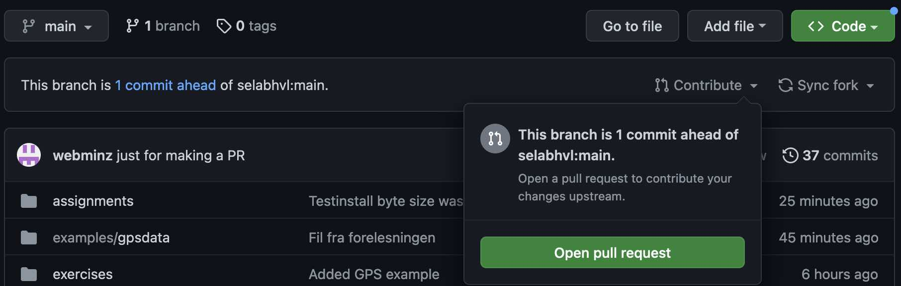
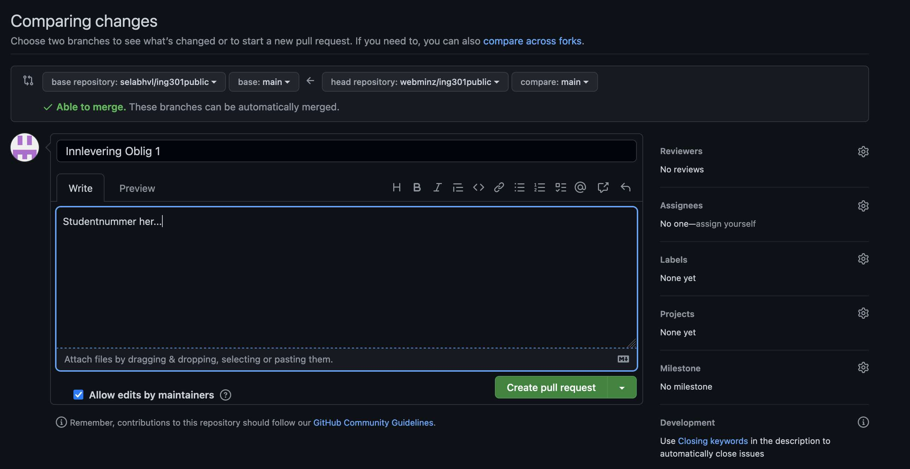

# Oppgaver - Uke 2/3

Formålet med oppgaven er en kort repetisjon av programmering i Python.

Implementer metodene i [wordfrequency.py](https://github.com/selabhvl/ing301public/blob/main/assignments/2-programming/wordfrequency.py) og test at de fungerer ved å bruke enhetstestene i [text_wordfrequency.py](https://github.com/selabhvl/ing301public/blob/main/assignments/2-programming/test_wordfrequency.py).

For å levere inn skal du åpne en _Pull Request_.
Åpne din private forken av `ing301public`. 
På toppen skulle du nå se en melding at du er noen commit "ahead av" hovedrepository (og kanskje samtidig noen commit bak).
Her får du under _Contribute_ en mulighet til å åpne en _Pull Request_:

I det vindu som åpner seg kan du skriver flere detaljer.
Husk å skrive inn studentnummeret ditt i kommentarfeltet.

Ikke forundrer deg når din Pull Request bare blir lukket:
Vi skal nemlig vanligvis ikke _merge_ inn din kode.
Vi brukerr _Pull Request_ bare for å følge med på innleveringer.
Når _Pull Request_ blir lukket så betyr det at innleveringen er notert.
Du kan da sjekke på Canvas at innleveringen skulle bli oppført som _godkjent_.

Frist for innlevering: Se Canvas
