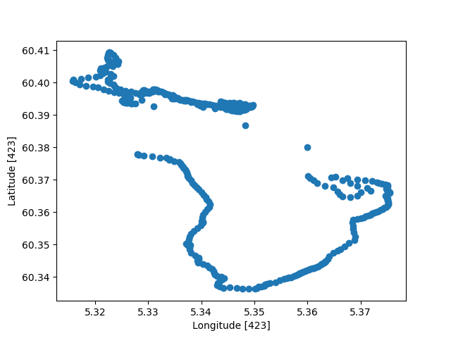
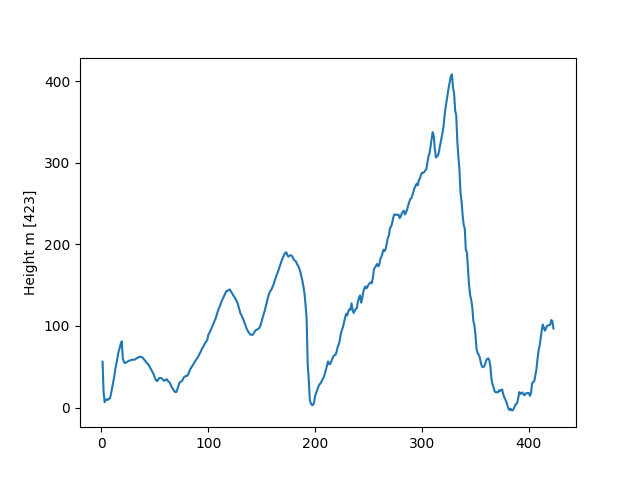
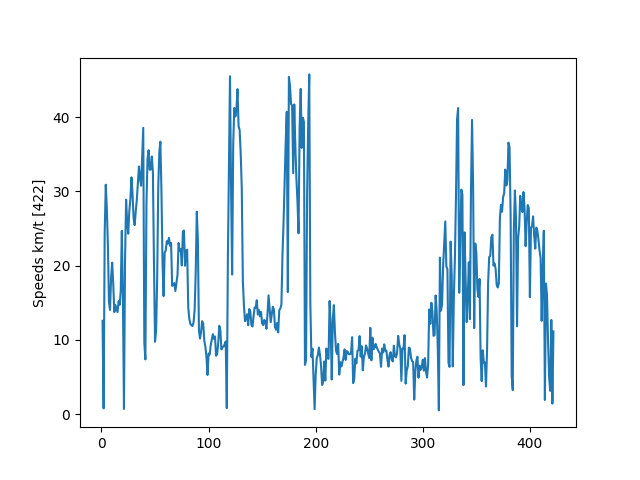

Denne mappen innholder eksempel Python kode som stort sett dekker hva som er programmerings forkunskaper for ING301. 

Eksempel koden inneholder de fleste konstruksjoner i Python er dekket av ING301 emnet.

Eksempel koden viser hvordan GPS datafiler fra en sykkelcomputer kan leses inn i Python og hvordan der kan gjøres beregninger på data.

Koden viser også hvordan mathplot biblioteket kan brukes til visualisering.

Hovedprogrammet finnes i filen [main.py](main.py)`. Når dette program kjøres gjøres beregninger som skrives ut i konsollen:

```
Total Time     : 1:29:54 s
Total distance : 25.27 km
Total elevation: 945.50 m
Max speed      : 45.78 km/t
Average speed  : 16.87 km/t
Energy         : 1631.91 kcal
```

og der opprettes tre grafer som viser ruten i X-Y-plan, høydeprofil samt hastigheter:





Python filer som begynner med ``test_`` inneholder test-klasser som viser hvordan enhetstester kan brukes til å test Python metoder og funksjoner.

Filen [gpsanalysis.py)](gpsanalysis.py) er kode som blev skrevet som den av undervisningen.
