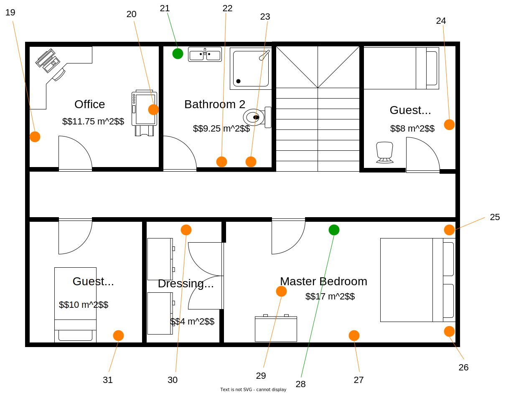

# Demo-Hus

For å teste din implementasjon på et konkret eksempel skal vi fra nå av baserer på et _demohus_.
Du finner en plantegning av dette huset nedenfor:

## Etasje 1

## Etasje 2

## Enheter

På etasjeplanen ble også smarte enheter tegnet inn.
Sensorer er tegnet i oransje og sensorer er tegnet i grønn.
Tabellen nedenfor gir detaljer hva type sensor/aktuator skjuler seg bak de enkelte tallene.

| Nr. | Typ                 | Produsent                  | Produkt Navn        | Serienummer         |
|-----|---------------------|----------------------------|---------------------|---------------------|
| 1   | Smart Lys           | Fritsch Group              | Tresom Bright 1.0   | f11bb4fc-ba74-49cd  |
| 2   | Smart Lys           | Fritsch Group              | Alphazap 2          | 480dbae8-cce7-46d7  |
| 3   | Fuktighetssensor    | Bernhard-Roberts           | Andalax             | 4cb686fe-6448-4cf6  |
| 4   | Smart Lys           | Fritsch Group              | Alphazap 2          | 6a36c71d-4f48-4eb4  |
| 5   | Smart Lys           | Larkin-Nitzsche            | Quo Lux             | d01130c9-a368-42c6  |
| 6   | Billader            | Jast, Hansen and Halvorson | Charge It 9000      | 0cae4f01-4ad9-47aa  |
| 7 | Paneloven           | Hauck-DuBuque              | Voyatouch 42        | d16d84de-79f1-4f9a  |
| 8 | Temperatursensor    | Moen Inc                   | Prodder Ute 1.2     | e237beec-2675-4cb0  |
| 9 | Smart Lys           | Fritsch Group              | Alphazap 2          | f4db4e54-cebe-428d  |
| 10 | Smart Lys           | Larkin-Nitzsche            | Quo Vadis Lux       | 8d09aa92-fc58-4c6   |
| 11 | Strømmåler          | Kilback LLC                | Transcof Current    | c8bb5601-e850-4a80  |
| 12 | Temperatursensor    | Moen Inc                   | Prodder Inne 2.3    | d16d84de-79f1-4f9a  |
| 13 | Smart Lys           | Fritsch Group              | Alphazap 2          | 390ae474-21fb-4e06  |
| 14 | Strømmåler          | Ward-Schaefer              | Zaam-Dox NetConnect | 3b06cf0f-8494-458b  |
| 15 | Smart Stikkontakt   | Kilback LLC                | Konklab 3           | c28b6e75-d565-4678 |
| 16 | Varmepumpe          | Osinski Inc                | Fintone XCX4AB      | 4eca6387-0767-4e4e |
| 17 | Luftkvalitetssensor | Hauck-DuBuque              | Sonair Pro          | c76688cc-3692-4aa3 |
| 18 | Smart Stikkontakt   | Kilback LLC                | Konklab 3           | 	4b9050f3-0ef0-4914 |
| 19 | Paneloven | Hauck-DuBuque              | Voyatouch 42        |   66373954-2ddd-4807 |
| 20 | Smart Stikkontakt   | Kilback LLC                | Konklab 3           | 1b34f6ce-94cb-4f7b |
| 21 | Fuktighetssensor | Bernhard-Roberts           | Namfix Y            |    8ceb53b2-e88f-4e8c |
| 22 | Luftavfukter | Steuber-Gerlach            | Aerified 42         | ae902f8f-10b4-4738 |
| 23 | Gulvvarmepanel | Steuber-Gerlach            | Temp Opp Pro 13     | 42f204bf-9944-47a1 |
| 24 | Paneloven | Hauck-DuBuque              | Otcom 2             | 73902f8f-10b4-4738 | 
| 25 | Smart Lys | Fritsch Group              | Alphazap 2          | 627ff5f3-f4f5-47bd |
| 26 | Smart Lys | Fritsch Group              | Alphazap 2          | ebaaadce-2d6b-4623 |
| 27 |  Varmepumpe          | Osinski Inc                | Fintone XCX2FF      | eed2cba8-eb13-4023 |
| 28 | Temperatursensor | Moen Inc                   | Prodder Inne 2.3    | 481e94bd-ff50-40ea |
| 29 | Smart Lys           | Fritsch Group              | Tresom Bright 1.0   | 233064d7-028a-407f |
| 30 | Smart Lys | Fritsch Group              | Alphazap 2  | 89393440-43cb-4cb5 |
| 31 | Paneloven | Hauck-DuBuque              | Otcom 2             | be490f21-b9cf-4413 |

## Startverdier

Til slutt: For å kunne gjennomføre noen reproduserbare tester skal enhetene initialiseres slikt:
Alle aktuatorer bortsett fra nr 14 er slått av i begynnelsen.
Sensorene skal for det første bare gi en statisk verdi, dvs. at hver gang man spørrer dem om en måleverdi gir de samme resultatet.

| Sensor Mr. | Måleverdi |
|------------|-----------|
| 3          | `68 %`    |
| 8          | `1.3 °C`  |
| 11         | `0 kWh`   |
| 12         |  `18.1 °C` |
| 14         |  `1.5 kWh` |
| 17         | `0.08 g/m^2` |
| 21         | `52 %`     |
| 28         | `16.1 °C` |