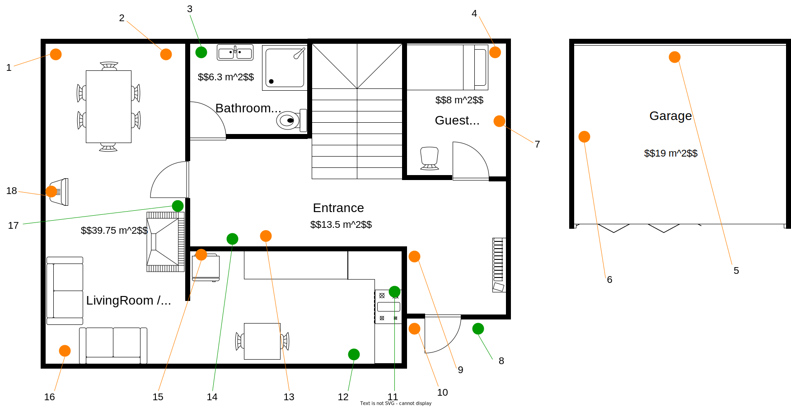

# Demo-Hus

For å teste din implementasjon på et konkret eksempel skal vi fra nå av baserer på et "_demohus_".
Du finner en plantegning av dette huset nedenfor:

## Etasje 1

## Etasje 2

## Enheter

Nedenfor finner dere mer detaljert informasjon (om id, produsent og modell) om enhetene i huset:

| Identifikator                          | Enhet      |  Produsent       | Modellnavn    | 
|----------------------------------------|------------|------------------|----------------|
| 4d5f1ac6-906a-4fd1-b4bf-3a0671e4c4f1   | Smart Lock  | MythicalTech | Guardian Lock 7000 |
| 8a43b2d7-e8d3-4f3d-b832-7dbf37bf629e   | CO2 sensor  | ElysianTech  | Smoke Warden 1000 |
| a2f8690f-2b3a-43cd-90b8-9deea98b42a7   | Electricity Meter | MysticEnergy Innovations  | Volt Watch Elite   |
| 5e13cabc-5c58-4bb3-82a2-3039e4480a6d   | Heat Pump        |  ElysianTech | Thermo Smart 6000    |
| cd5be4e8-0e6b-4cb5-a21f-819d06cf5fc5   | Motion Sensor |  NebulaGuard Innovations  | MoveZ Detect 69  |
| 3d87e5c0-8716-4b0b-9c67-087eaaed7b45   | Humidity Sensor | AetherCorp | Aqua Alert 800 |
| 8d4e4c98-21a9-4d1e-bf18-523285ad90f6   | Smart Oven |   AetherCorp    | Pheonix HEAT 333 | 
| 9a54c1ec-0cb5-45a7-b20d-2a7349f1b132   | Automatic Garage Door | MythicalTech | Guardian Lock 9000 |
| c1e8fa9c-4b8d-487a-a1a5-2b148ee9d2d1   | Smart Oven | IgnisTech Solutions     | Ember Heat 3000 |
| 4d8b1d62-7921-4917-9b70-bbd31f6e2e8e   | Temperature Sensor        | AetherCorp  | SmartTemp 42 | 
| 7c6e35e1-2d8b-4d81-a586-5d01a03bb02c   | Air Quality Sensor        | CelestialSense Technologies | AeroGuard Pro   | 
| 1a66c3d6-22b2-446e-bf5c-eb5b9d1a8c79   | Smart Plug | MysticEnergy Innovations                   | FlowState X |
| 9e5b8274-4e77-4e4e-80d2-b40d648ea02a   | Dehumidifier           |  ArcaneTech Solutions | Hydra Dry 8000     |
| 6b1c5f6b-37f6-4e3d-9145-1cfbe2f1fc28   | Light Bulp          | Elysian Tech | Lumina Glow 4000 | 

