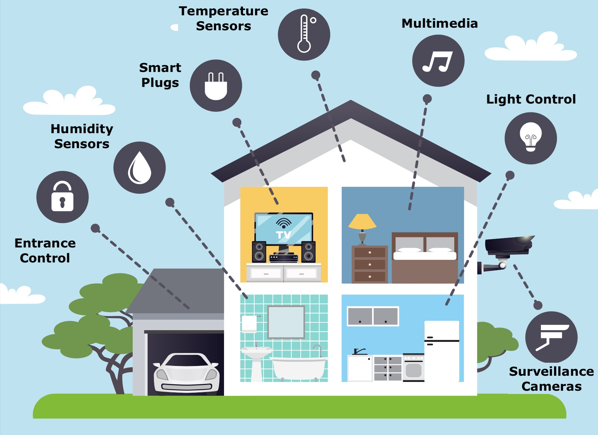

# Programmeringsprosjekt: Smart Home

De obligatoriske innleveringene i ING301 er basert på et større sammenhengende prosjekt: 
Dere skal bygge et system som kan styre et "_Smart Home_", sammenlignbar med f.eks. [Home Assistant](https://www.home-assistant.io/).

## Intro

_Smarthus_ er et begrep som dekker forskjellige typer av _hjemmeautomatisering_.
Dette er basert på "_intelligente_" enheter (_Internet of Things (IoT)_ devices) som kan kommuniserere gjennom nettverksteknologier og dermed muliggjør bla. overvåkning, regulering og optimalisering.
For eksempel kan en internettstyrt temperatursensor og panelovn styres slik at den holder temperaturen i et rom på et viss nivå eller en intelligent strømmåler kan prøve å optimalisere strømforbruket.
Systemet dere skal utvikle skal først og fremst _forvalte_ bygget og de forskjellige enhetene i det, dvs. lokasjonen, måleverdier eller tilstand (f.eks: "Er enheten slått på eller av?")

## Domenebeskrivelse

Systemet kan installeres i forskjellige _bygninger_ (_Buildings_).
En byggning består av forskjellige _etasjer_ (_Floors_) som selv består av flere _rom_ (_Room_).
Et _rom_ kan gis et _navn_ (f.eks. "stue", "kjøkken", "bad", ...) og hvert rom har et _areal_ målt i $m^2$.
Etasjer har et _etasjenummer_. Arealet til en etasje kan beregnes ved å summere arealene til de enkelte rommene.

Desto videre forvalter systemet _enheter_ (_devices_).
En enhet registreres med et _identifikasjonummer_ og dens produktegenskaper, dvs. _produsentnavn_, _modellnavn_ og hva for en enhet det dreier seg om (varmeovn, lyspære, strømmåler, osv.).
I tillegg kan enheten gis et _huskenavn_ (f.eks. "Varmepumpe Bad"). 
En enheten må registreres i ett rom i huset.

Vi skiller mellom to type enheter: _sensorer_ og _aktuatorer_. 

Eksempler på sensorer er temperturmålere, luftfuktighetsmålere, strømforbruksmålere, CO2 målere, bevegelsessensorer osv.
En sensor må ha en funksjon som leverer den siste _måleverdien_ og historien av tidligere måleverdiene.
En måleverdi består av _dato_, _klokkeslett_, _verdi_ (numerisk) og _måleenhet_ (f.eks. `°C` for temperatur, `%` for luftfuktighet osv.).

Aktuatorer er enheter som påvirker de fysiske omgivelsene.
Eksempler er panelovner, varmepumper, luftavfuktere, stikkkontakter, lyspærer osv. 
Aktuatorer har en _tilstand_ og funksjoner til å forandre denne interne tilstanden.
Noen aktuatorer kan bare slås av og på (f.eks. stikkontakt eller lyspære uten dimmer) mens andre kan styres i større grad (f.eks. kan varmepumpen settes til et ønsket temperatur som `21.3 °C`).

Til syvende og sist må det nevnes at noen enheter både viser sensor og aktutor egenskaper (f.eks en styrbart stikkontakt som samtidig måler strømmen) eller at noen sensorer måler forskjellige verdier samtidig (f.eks. en _luftkvalitetssensor_ måler CO2, luftfuktighet og VOC (flyktige organiske forbindelser) samtidig).

## Oppgaver

Mer informasjon om de fire deloppgavene i prosjektet blir lagt ut fortløpende i kursforløpet. Prosjektet kan løses i grupper med opp til 3 personer.

### Del A: Domenemodell og grunnlegende Funksjonaliteter

I første prosjektsteg skal gruppen legge grunnlag for hele systemet ved å _planlegge_ og _implementere_ en _domenemodell_:

[Se detaljer](https://github.com/selabhvl/ing301-projectpartA-startcode)

### Del B: Datalagring

I neste steg skal gruppen sørge få at informasjon blir lagret permanent på en harddisk når systemet avsluttes og at denne lagrete informasjonen kan leses igjen. Dette skal gjøres via database-teknologi.

[Se detaljer](https://github.com/selabhvl/ing301-projectpartB-startcode)

### Del C: Nettbasert tilgang

I dette steget skal gruppen bruke nettverksprotokoller for at smart-hus funksjonaliteten kan tilbys via en web-tjeneste. 

[Se detaljer](https://github.com/selabhvl/ing301-projectpartC-startcode)

### Del D: Integrasjon med andre enheter

I det siste steget skal gruppen se op hvordan systemet kan koples opp mot de ulike hardware enheter (IoT devices), sensorer og aktuatorer.

