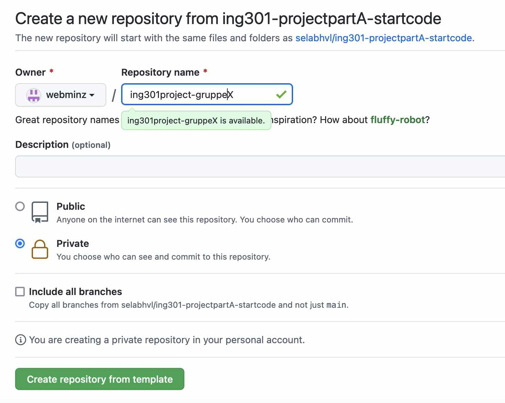

# Part A: Domenemodell og Basisfunksjonalitet

## Utsjekk og 'kom i gang'

Dette er et gruppeprosjekt.
Derfor skal dere opprette en ny Github repository for at dere kunne dele projektkode med hverandre.
Vi har laget det som kalles en _template repository_ for å dele ut startkoden:

https://github.com/selabhvl/ing301-projectpartA-startcode

**OBS! Det er bare en i hver gruppe som må utføre følgende steg**

Gå til github URL'en ovenfor og trykk på "Use this template" (Der det vanligvis står "Code" i grønt).
Velg første opsjon "Create a new repository".
Du kommer du en ny side.
Her skal du gi repo'en et godt navn, f.eks. noe somm inneholder ing301 og ditt gruppenummer.
I tilegg skal du gjøre repo privat slik at bare inviterte folk kan se inneholdet.



Når du har opprettet repo'en kan du dele tilgang med dine gruppemedlemmer.
Gå på "Settings" > "Collaborators and teams" > "Add people".
Du kan søke opp de andre med deres GitHub brukernavn eller epost.
(På samme måten skal du til slutt dele tilgang med meg og Lars når dere innleverer koden).

Når tilgangene er på plass kan alle i gruppen ssjekke ut koden på vanlig måte.
Trykk på "Code" på hovedsiden og så kopierer du URLen.
I GitHub Dekstop på venstre siden trykker du på "Add" > "Clone Repository" og så limer du inn URLen.
Da vil du få lastet ned koden lokalt og du kan begynne med prosjektet.
Vi anbefaler at du åpner prosjektet i VS Code eller PyCharm som du hadde gjort det den første gangen du sjekket ut `ing301public`.

## Oversikt

I repository finner du i begynnelsen følgende filer:
- `.gitignore` ikke relevant for deg nå
- `README.md` heller ikke relevant nå
- `devices.py` Denne filen er nesten tomt. Her står dere helt fritt og designe deres egne klassstruktur for å representere enheter og funksjoner.
- `main.py` Denne filen er starterfilen til en kommandolinje applikasjon. I denne filen skal fylle ut funksjonen `build_demo_house()` (se nedenfor).
- `smarthouse.py` Denne filen inneholder klassestruktur som representerer et hus, etasjer og rom. Her skal du implementere alle funksjoner i klassen `SmartHouse`.
- `smarthouse_test.py` Denne filen inneholder enhetstester du kan kjøre for å teste implementasjon din.

Hovedoppgaven er altså å fylle ut de manglende implementasjonene i `main.py` og `smarthouse.py` ved å lage spesifikke klasser i `devices.py`.Mer konkret skal dere jobbe gjennom følgende steg:

1. Les nøye gjennom [Problembeskrivelsen](./index.md) og lag deretter en _domenemodell_ (klassediagramm) av hele situasjonen. Du skal sannsynligvis lage forskjellige klasser for de foskjellige enhetene. Inkluder også de klassene som allerede finnes i `smarthouse.py`. Du kan tegne klassedigramm enten på ark og scanne dem eller bruk et grafisk verktøy som f.eks. [diagrams.net](https://www.diagrams.net/).
2. Oversett deretter klassediagrammet til klasser i Python ved å utvide `devices.py` filen. Tenk også på metodene disse klassene skal ha.
3. Etterpå kan dere implementere funksjone som registrer enheter på rom i huset i `smarthouse.py`.
4. Når registreringsmuligheter er på plass kan du prøve å gjenskape en digital versjon av demo-huset (se nedenfor) ved å lage etasjer, rom, enheter i `build_demo_house()` i `main.py`.
5. Til slutt kan dere implementere de resterende funksjonene i `smarthouse.py` og kjører testene for å sjekke om alt virker.


## Demo-Hus

For å teste implementasjon din på et eksempel skal et "demo hus" legges inn i systemet.
Dette skal gøres i funksjonen `build_demo_house()` i `main.py`.
Demo-huset er beskrivet [her](./demo.md).

## Implementasjonskrav

For å kunne sammligne deres løsninger må alle enheter vise en enhetlig _representasjon_ når disse skrives ut.
I Python kan man bruke `print()` funksjonen til å skrive ut en objekt.
Standardmessig er denne presentasjonen veldig generisk og gir bare informasjon over klasse og memory-adresse.
Man kan forandre denne oppførelsen ved å overskrive ``__repr__()`` funksjonen i en gitt klasse:
```python
class MyObject:
    
    def __repr__(self):
        return "my custom representation here"
```
I deres applikasjon skal enheter skrives ut i følgende format:
```
<Sensor eller Aktuator>(<serienummer) TYPE: <enhetstype> STATUS: <enhetsstatus> PRODUCT DETAILS: <produsent> <produktnavn>
```
I `enhentstype` finner man hva type enhet man ser på (Smart Lys, Temperatursensor, osv).
Alle relevante enhetstyper finner du i [beskrivelsen av demo-huset](./demo.md).
Hvis enheten er en sensor skal `enhetsstaus` viser den nåværende måleverdien med enhet (`°C` for Temperatur, `%` for Luftfuktighet, `kWh` for Strøm, `g/m^3` for Luftkvalitet).
Hvis enheten er en aktuator som styrer temperatur (altså panelovener, varmepumper og gulvvarme) så skal status vise temperaturen som ehenten er stilt inn på.
For øvrige aktuator vises bare om enheten er på (`ON`) eller av (`OFF`). 

Nedenfor noen eksempler:
```
Sensor(e237beec-2675-4cb0) TYPE: Temperatursensor STATUS: 3.2 °C PRODUCT DETAILS: Moen Inc Prodder Ute 1.2
Aktuator(f11bb4fc-ba74-49cd) TYPE: Smart Lys STATUS: OFF PRODUCT DETAILS: Fritsch Group Tresom Bright 1.0
Aktuator(eed2cba8-eb13-4023) TYPE: Varmepumpe STATUS: 16.0 °C PRODUCT DETAILS: Osinski Inc Fintone XCX2FF
```
