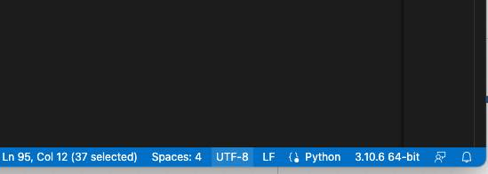

# Uke 3

Velkommen tilbake til ING301 og uke 3!
Hovedtema i dag er innføring i _objektorientert programmering_.
Men før vi begynner med det skal vi først lære noe nytt om `git` og komme tilbake til noe "løse tråder" fra forrige uke:

## Fortsettelse `git`

Sist gang har vi brukt `git` for å laste ned kode. Da har du brukt

```bash
git clone <url>
```
til å klone din GitHub fork på din maskin.

Kanskje du har også jobbet litt med sartkoden allerede og brukt
```bash
git add <fil>
git rm <fil>
git commit -m <melding>
git status
git log
```
til å legge til eller fjerne filer fra git. Lagre dine endringer, sjekke nåværende endringe, og se gjennom endringshistorien.
Vi har lagret en video på Canvas som oppsumerer disse grunnlegende kommandoene.

I dag skal vi se
- hvordan du laster ned endringer fra hovedrepository'en (https://github.com/webminz/ing301public/)
- og laste opp dine fremskritt i din personlig GitHub repository (https://github.com/<dinbruker>/ing301public/)


### Nedlasting

For å laste ned endringer fra hovedrepo'en må du først sjekke om du har lagt den til som remote
```bash
git remote -v
```

Hvis du ikke se URL'en i denne listen. Kan du legge den til slik:
```bash
git remote add upstream https://github.com/webminz/ing301public.git```
```

Når du har en lenke til `upstream` remote'en så kan du først _laste ned_ endringene:

```bash
git fetch upstream
```

og kombinere dem med dine endringer slik:
```bash
git rebase upstream/main
```

Her er det en liten sjanse for at du får det som kalles en _konflikt_.
Dvs. endringene som har skjedd på det samme fil.
For å løse opp konflikter har vi laget et eget video.


### Opplasting

For å laste opp dine endringer bruker du
```bash
git push origin
```

## Ting fra forrige uke

### Filadressering

Som vi har vist forrige uke kan du bruke _relativ addressering_ i Python sin `open()` funksjon.
Dvs. du kan referrere til en annen fil ved å skrive filstien begynnende med filen der du er akkurat nå.
Når du til slutt kjører filen din med Python fortolkeren er det viktig at du befinner deg i samme mappen der filen ligger.
_PyCharm_ fil alltid kjøre filene slik at den er på riktig sted, men _VS Code_ er av og til på feil plass når du trykker på den _grønne pilen_.
Sjekk hvor du er  _Terminal_ vinduet nede og bruk `cd` til å komme deg til riktig plass!


### Encoding

Hvis du bruker Windows og har begynt med _assignment 2_ kan det være at du har fått noen problemer knyttet til _filkodering_.
Det er fordi Windows bruker vanligvis en annen Encoding (som heter `cp1252`) mens Mac og Linux bruker Unicode (`utf-8`).
Vår repository bruker også UTF-8.
Windows encoding og unicode stemmer overens på de vanlige engelske bokstavene (ASCII). 
Men den avviker når man bruker andre tegn som f.eks. Æ, Ø, Å...
Hvis du bruker Windows må du altså sjekke at din VS Code/PyCharm er satt til riktig encoding.
Du ser dette i det nedre høyre hjørnet.




## Objektorientering

Etter forlesningen skulle du

- kjenne til to "nye" Python nøkkelord: `class` og `pass` og vet hva de betyr
- ha en forståelse av begrepene:
  - objekt/instans
  - klasse
  - metode
  - attributt
  - konstruktor, og
- vet hva ideen "Tell, don't ask!" betyr

Du finner slides'ene om OO på Canvas og kodeeksempler fra forelesningen:

[Kode for det objekt-orienterte GPS data eksemplet](../../examples/03_gpsdata_oo/) 